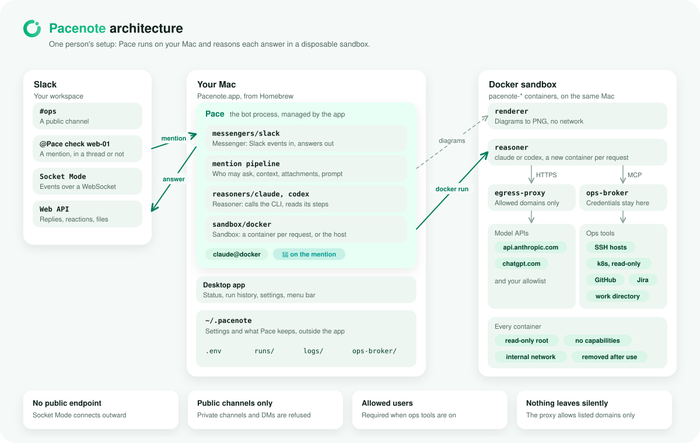
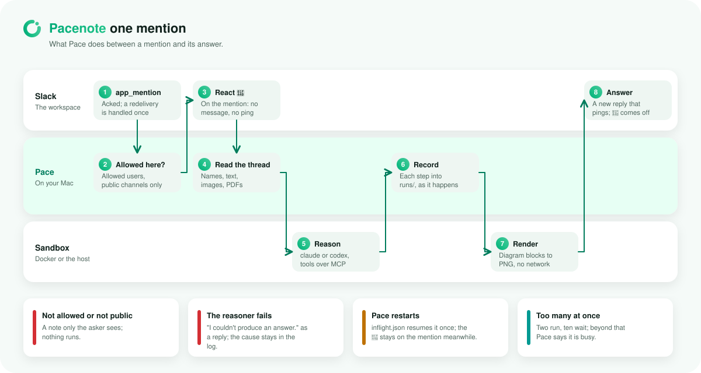

# Architecture

How Pacenote is put together, in five pictures. The diagrams are drawn by `scripts/diagrams.mjs`
(`pnpm docs:diagrams`) in the desktop app's look, with a light and a dark variant.

## The pieces

Pace, the bot, runs on your Mac as a process the desktop app manages, in four layers: the Slack messenger, the
mention pipeline, the reasoner that calls your `claude` or `codex` CLI, and the sandbox the CLI runs in. Slack reaches
it over Socket Mode, so nothing listens on a public port. With the Docker sandbox, each answer is reasoned in a new,
hardened container whose only ways out are the egress proxy (the model APIs and the domains you allow) and ops-broker
(ops tools, with the credentials kept in the broker); without it, the CLI runs on your Mac with your own login.
Diagrams are rendered in a container of their own, with no network. Settings and everything Pace keeps live in
`~/.pacenote`.

<picture>
  <source media="(prefers-color-scheme: dark)" srcset="diagrams/architecture-dark.svg">
  
</picture>

More: [How it works](how-it-works.md), [Reasoner sandbox](sandbox.md), [Ops tools](ops-tools.md),
[Desktop app](desktop-app.md).

## One mention

A mention is checked (allowed users, public channels), marked with 👀 at once, and reasoned with the thread and its
attachments as context. Each step goes into the run history as it happens, diagram blocks are rendered, and the answer
comes as a new reply. A restart resumes an unfinished answer once, with the 👀 still on the mention.

<picture>
  <source media="(prefers-color-scheme: dark)" srcset="diagrams/mention-flow-dark.svg">
  
</picture>

## Team hub

For a team, one hub server holds the Slack app and routes each member's mentions to that member's own desktop, which
answers with that member's login, sandbox and tools. Desktops pair once with a code sent to Pace in Slack and never
hold a Slack token.

<picture>
  <source media="(prefers-color-scheme: dark)" srcset="diagrams/team-hub-dark.svg">
  
</picture>

More: [Team hub](team-hub.md).

## Layers

Three interfaces keep the mention pipeline apart from everything it could be swapped for:

- **Messenger** (`src/messengers/types.ts`): the chat app. Mentions come in through it and answers, edits and images go
  out. Slack is the adapter today.
- **Reasoner** (`src/reasoners/types.ts`): the model. The pipeline asks for one answer and gets progress steps along
  the way. Each CLI is a `CliAdapter` (`claude.ts`, `codex.ts`) that says how to call it, what it may read, and how to
  read what it prints; one runner (`cli.ts`) runs any adapter.
- **Sandbox** (`src/sandbox/runtime.ts`): where the CLI runs. A sandbox runs one process with the environment values,
  mounts and working directory it is given, and knows nothing about which CLI it is. `host.ts` runs it on your Mac with
  your login; `docker.ts` runs it in a disposable, hardened container. An isolated sandbox puts mounts at fixed paths
  (`SANDBOX_PATHS`: `/workspace`, `/attachments`, `/out`, `/run/secrets`) that the reasoner image is built for.

`src/index.ts` builds one of each from the settings. The dashed slots are where the next ones go.

<picture>
  <source media="(prefers-color-scheme: dark)" srcset="diagrams/layers-dark.svg">
  
</picture>

## Code layout

The mention pipeline (`src/mention`) talks to chat apps only through the `Messenger` interface
(`src/messengers/types.ts`); Slack is its first adapter. Models are reached through `src/reasoners` and run in
`src/sandbox`, as above.

<picture>
  <source media="(prefers-color-scheme: dark)" srcset="diagrams/code-layout-dark.svg">
  
</picture>

More: [Development](development.md), including how to add a messenger, a reasoner or a sandbox.
